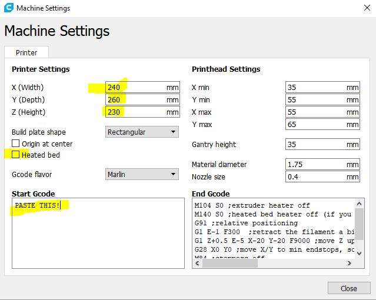

# Type A Machines Series 1 2013 Wood edition with Full Graphic Smart Controller 

## Adding the printer to Cura
*  [Download the latest version, install and open Cura](https://ultimaker.com/en/products/ultimaker-cura-software)
* Click here in the top right corner:

* Click "Add printer"
* Choose "Other", select the "Type A Machines Series 1 2014" and accept 
* Click here again

* Click "Manage printers", select "Type A Machines Series 1 2014" and press "Machine settings"
* This menu will pop up, change the  highlighted items according to this image and [paste this code into the "Start Gcode" box](start_g_code.txt)

* Now you are ready to print using SD card on the Type A Machines series 1 2013 wood editon! 
* To switch between printers, click here:

## Using the Smart Controller

You can navigate the menus on the Smart-Controller by turing or pressing the knob on the controller. To activate, turn on the power switch by the power cord and when the printer has powered on, press on the knob to start.

### Printing
Load your gcode file onto a SD card and select "Print from SD Card in the menu", find and select your file and it should start.

### Changing Filament
To Change the filament you need to first heat the filament to its melting temperature, for PLA filament this is 210 C.
Find the Nozzle temperature settings in the menues, I think they are under "Control".

# Firmware files (only needed if you upgrade/rebuild the printer)
In the marlin directory there is a version of the Marlin 1.1 firmware configurated to run on  Type A Machine Series 1 3D printers from 2013 (plywood frame) equipped with a [DiscountRepRap Full Graphics Smart controller with LCD display and SD card reader](http://reprap.org/wiki/RepRapDiscount_Full_Graphic_Smart_Controller).

This printer type has a RAMPS1.4 card but it is wired a bit different from the standard way so the pins had to be reconfigured to account for things like that the two Y-motors are connected to the connectors marked with Z, among other things. But this is all accounted for in the firmware, just upload it like you would any marlin installation but use these files.

## Pictures from the installation of the Smart Controller

.JPG)
.JPG)

